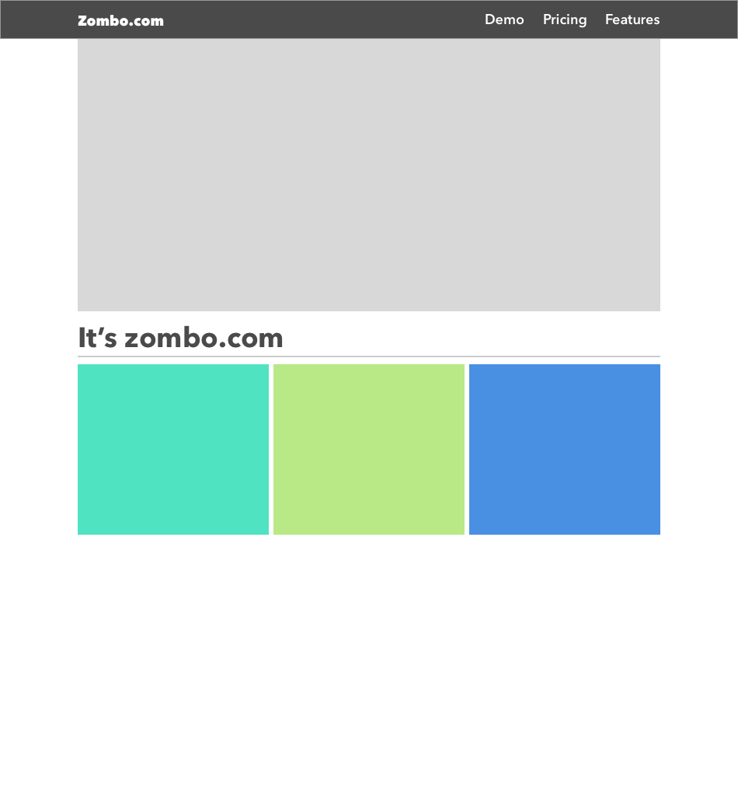
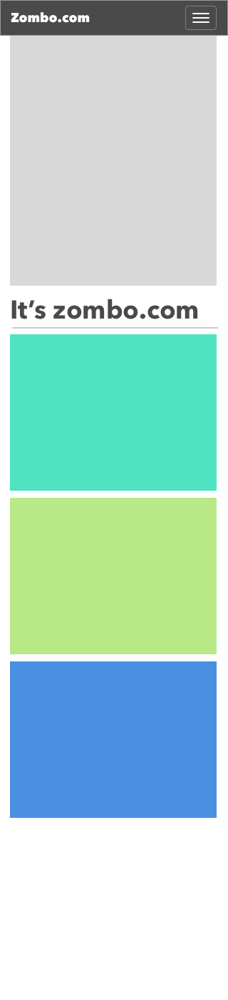

# Enoncé
Le but de cet exercice est de reproduire au plus proche le design de page web responsive suivant : 

**Desktop**

**Mobile**

## Solution demandée
Vous devez founir les sources et dépendances nécessaires pour pouvoir visualiser votre solution dans un navigateur web

## Langages
HTML, CSS, JS et frameworks de votre choix. 

